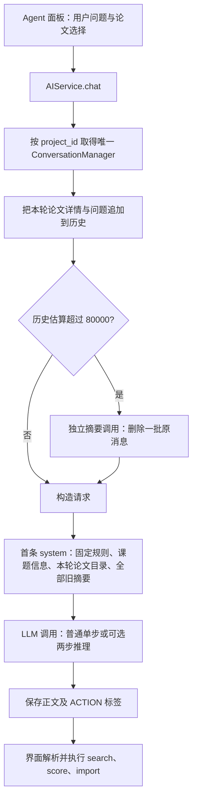
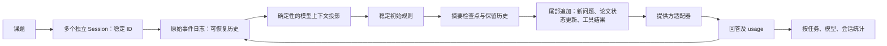

# PaperPilot Agent 缓存、会话与上下文研究

研究日期：2026-10-01。源码基线：`develop`，`2a37161694b0cbbfdd12554cb91fa8a50c89f571`。

## 结论与证据边界

用户观察的是本地 PaperPilot 调用 DeepSeek V4.1 Flash 时，DeepSeek 官网统计的**输入 token 缓存命中占比低于 10%**。用户需要的“新会话”是同一课题下多个互相独立的聊天。

当前最有力的结构性线索是：**每轮选中的论文被写进首条 system，发送后界面又清空选择，下一轮因此重写请求头部。** 历史放在这个变化点之后，难以复用完整的历史缓存前缀。压缩摘要、课题描述更新也会改变首条 system。

但不能仅凭源码把官网的全部低命中量归因于这一项：尚未取得实际请求级 usage、实际请求间隔和任务分类。如果用户连续聊天时没有更换论文、课题描述或发生压缩，当前普通消息历史大体保持追加，仍应进一步排查冷启动、缓存过期、模型路由、辅助调用及服务端行为。

**同课题多会话目前缺失；后台自动压缩已经存在。** 压缩没有手动入口和即时提示，并有预算统计不完整、可能拆开一轮对话、摘要截断和原文不可恢复等问题。

本轮完成源码分析、一手资料研究与离线结构复现，交付诊断和改造设计。未修改运行代码，未读取实际密钥配置或用户聊天数据，未调用收费模型，未验证实际命中率改善。

## 1. 研究范围与方法

- 主模型复查本项目 Agent 面板、AI 服务、会话管理和 LLM 适配器的真实调用链；此前指定的 GPT-6 Luna max 子代理全面扫库结果用于定位，由主模型自行复核。
- 查看六个开源项目的相关源码或工程文档，并将源码固定到当前查证的提交。覆盖 DeepSeek Harness、Codex、Gemini CLI、DeepAgents、OpenCode、Pi；另研读 Claude Code 的官方缓存、会话及上下文文档。
- 阅读两份技术论文的相关内容，以及八篇一手工程报告的相关章节。2026 年资料用于当前设计核对，2025 年资料用于已成熟的基础设计；不把旧文档当成当前接口。
- PDF 按 `pdf` skill 推荐方法使用 pypdf 在内存提取；没有把 PDF 或临时脚本保存到磁盘。V4.1 报告重点阅读摘要、架构说明及第 19–20 页缓存管理；Cordis 论文读取摘要和目录，未完成其形式化证明及完整案例的研读，因此只作为框架背景。
- 只用合成历史执行离线前缀比较。它检验请求构造行为，不能替代 DeepSeek 实测。

访问限制：当前会话没有可调用的 ddg-search，备用搜索服务多次网络失败；通过本地 URL 读取工具、官方目录和 GitHub API 定位资料。部分站点超时或访问受限后，使用只读直连读取官方 PDF 和固定提交源码。未成功读取的材料不作为结论依据。

## 2. 当前 Agent 的实际结构



这是带操作分发的科研对话助手。已有历史持久化、论文引用、自动压缩和操作执行，但工具执行结果没有形成规范的模型 tool-call → tool-result → 下一步模型请求循环。检索、评分、精读等辅助任务也可能产生额外 LLM 请求。

| 部分 | 当前行为 | 关键代码 |
| --- | --- | --- |
| 会话标识 | `_conversations` 按 `project_id` 缓存，一个课题一个管理器 | [ai_service.py](E:/paperpilot/paperpilot/ai_service.py:736) |
| 磁盘存储 | `repository/{清洗后的课题名}/conversation.json` | [conversation.py](E:/paperpilot/paperpilot/conversation.py:59) |
| 动态论文目录 | 由本轮显式选择和自动识别的论文生成，不是固定的全库快照 | [ai_service.py](E:/paperpilot/paperpilot/ai_service.py:744) |
| 请求头部 | 每次重建 system，加入目录和全部摘要 | [conversation.py](E:/paperpilot/paperpilot/conversation.py:210) |
| 自动压缩 | 发送前检查，调用摘要模型后替换一批旧消息 | [ai_service.py](E:/paperpilot/paperpilot/ai_service.py:770) |
| 用户可见能力 | 能按课题载入历史；无独立聊天列表、新聊天或手动压缩入口 | [agent_panel.py](E:/paperpilot/pages/agent_panel.py:587) |
| API 统计 | `ChatResult` 只保留正文和推理，丢弃 usage | [llm_client.py](E:/paperpilot/paperpilot/llm_client.py:44) |

UI 初始显示最近 30 轮是显示分页，不能据此认为 API 只发送最近 30 轮。API 使用全部未压缩历史。

## 3. DeepSeek 当前缓存规则及其含义

DeepSeek 的服务端上下文缓存默认启用，应用不需要单独开一个缓存开关。当前官方文档强调：后续请求需要完整匹配已经持久化的前缀单元。请求输入和输出边界、检测出的共同前缀以及长序列的固定间隔会形成这类单元。[DeepSeek 缓存指南](https://api-docs.deepseek.com/guides/kv_cache)

因此，连续请求从 `A+B` 扩展为 `A+B+C` 有利于复用；从 `A+B` 改成 `A+C` 时，不能假定第一次请求已经单独持久化了 `A`。共同前缀可能在后续检测、持久化后才命中。仅有文字相似并不等于立即命中。

V4.1 的技术报告进一步区分持久化的 global KV 与短期 SWA 状态，并通过 bounded replay 降低部分状态缺失时的恢复成本。这属于服务端模型及部署设计，不能靠 PaperPilot 添加一段“KV 压缩代码”获得同样能力，也不能把报告中的存储节省倍数当成应用命中率。报告描述的部署保留时间也不应被解读为公开 API 的命中保证。[V4.1 技术报告，第 19–20 页](https://huggingface.co/deepseek-ai/DeepSeek-V4.1-Flash/blob/main/DeepSeek_V41_Tech_Report.pdf)

## 4. 低命中原因：按证据强弱排序

### 4.1 首条 system 随论文选择变化：优先处理

当前调用链为：

1. 面板捕获选中的论文。
2. 面板立即清空论文勾选。
3. `chat()` 把本轮论文目录加入 system。
4. 下一轮没有选中或识别论文时，这个目录从 system 消失。
5. 两次请求在聊天历史之前就出现差异。

这是源码明确存在的缓存不利设计。若用户经常选择、比较、切换论文，它非常可能对低命中贡献较大。课题描述被更新时也有同类影响。证据见 [面板清空选择](E:/paperpilot/pages/agent_panel.py:447)、[目录生成](E:/paperpilot/paperpilot/ai_service.py:779)、[请求头部拼接](E:/paperpilot/paperpilot/conversation.py:220)。

改法：保持会话的初始规则稳定；把论文选择、课题资料更新作为**尾部追加的上下文事件**，并明确这些更新取代哪项旧状态。不要为了缓存把变化的信息隐藏起来。论文正文和摘要已经附在用户消息中，可优先去掉 system 中重复的本轮目录；长远再做按论文版本去重及按需取证。

### 4.2 压缩会重写首条 system，而且摘要调用独立构造前缀

压缩后的摘要被累积塞进 system，历史前缀改变。一次真正的上下文缩短本来就会让工作历史进入新的缓存阶段；问题是现在连原本可稳定保留的 system 也一起变化。

另一个可改之处是摘要请求：当前换用独立 `_COMPRESS_SYSTEM`，把每条历史截取后拼成另一份 user 文本。DeepSeek Harness 则保留会话已有的 system、工具和消息前缀，在最后追加压缩指令，尽量复用摘要调用的暖缓存。适用条件是摘要请求使用兼容的模型、前缀仍在缓存中，并满足上下文与摘要预算；不能无条件保证命中。[Harness summarizer](https://github.com/deepseek-ai/deepseek-harness/blob/639ed015397290b3745d163aafe02ffee4aa3f84/packages/compaction/compaction-basic/src/summarizer.ts)

### 4.3 缺少请求级统计：无法归因官网总数

当前适配器丢弃 `resp.usage`，业务层也只接收正文/推理，因此无法判断某次对话到底命中多少、哪些请求占了主要未命中 token。

官网统计可能混合对话、精读、评分、论文信息抽取、压缩，以及同一 key 的其他调用；目前只知道用户使用的模型，未核对实际统计区间和调用集合。应先按任务分组，再计算：

```text
输入缓存占比 = sum(cache_hit_input_tokens)
             / sum(cache_hit_input_tokens + cache_miss_input_tokens)
```

不能平均每次请求的百分比；也不能把缺失 usage 当成 0 命中。提供方字段含义不同，统一统计前要做适配并保留原始计数。[DeepSeek usage 字段](https://api-docs.deepseek.com/guides/kv_cache)、[Claude Code 主对话缓存统计](https://code.claude.com/docs/en/costs)

### 4.4 可选两步推理与模型路由：需要实际配置验证

如果配置了 `reasoning_model`，回复请求会追加一条本轮临时推理 system，但这条消息没有进入持久化历史。下一轮无法完整重放上次请求的这部分前缀；两个模型也需要分别观察缓存。这个路径存在，但本轮没有读取用户实际配置，**不能断言它已开启**。[ai_service.py](E:/paperpilot/paperpilot/ai_service.py:799)

### 4.5 工作负载、冷启动、请求间隔及服务端行为

多步工具 Agent 经常在同一长前缀后追加较短工具结果，然后连续调用模型；PaperPilot 常见的是人类逐轮聊天或单次精读。两者的缓存比例不能直接比较，也不存在本轮已查证的“所有通用 Agent 应达到某个百分比”的基准。

新聊天、模型切换、长时间间隔或一次很大的新材料输入都会改变统计。DeepSeek 缓存为 best effort，构建需要时间，不能把两次立即重发的结果当成充分验证。[DeepSeek 缓存指南](https://api-docs.deepseek.com/guides/kv_cache)、[Manus 工程报告](https://manus.im/blog/Context-Engineering-for-AI-Agents-Lessons-from-Building-Manus)

### 4.6 当前没有证据支持的解释

- 新建 Python SDK client 主要影响连接复用和延迟，没有证据说明它直接让服务端文本缓存失效。
- 存入历史的消息时间戳是当时固定的，并非每轮重新生成；不能笼统说“有 timestamp 所以每轮都 miss”。API 消息仍应投影为提供方认可的字段，UI 元数据留在本地。
- 当前请求没有原生 `tools`。按 DeepSeek 现行文档，这种模式下历史 `reasoning_content` 即使传回也会被忽略。因此“没有回传思维链”不是已查证的当前主要原因。以后接入原生工具调用，则必须按该模式完整保存并回放相应推理与工具内容。[DeepSeek Thinking Mode](https://api-docs.deepseek.com/guides/thinking_mode)
- Redis、答案缓存、向量库、RAG 和服务端 prompt/KV 缓存是不同层次的机制。前三者可以支持其他业务，不能自动修复本次请求前缀变化。

## 5. 离线复现：已验证什么

直接从当前源码 AST 取出 `ConversationManager` 和 `_CHAT_SYSTEM`，禁止加载/保存用户历史，用 20 条合成历史比较 role/content 组成的文本前缀。结果如下：

| 场景 | 上一请求字符数 | 共同前缀字符数 | 字符比例 |
| --- | ---: | ---: | ---: |
| 保持目录相同，尾部追加问题 | 23,547 | 23,547 | 100.00% |
| 下一轮清空论文选择 | 23,547 | 1,270 | 5.39% |
| 下一轮更换论文 | 23,547 | 1,290 | 5.48% |
| 运行现有压缩，摘要进入 system | 23,560 | 1,307 | 5.55% |

这些数字是**字符级结构演示，既不是 tokenizer 结果，也不是服务端缓存命中率或其精确上限**。它们证明头部变化会使长历史不再处于相同前缀后，不能据此说已经复现了用户官网的“不到 10%”。

另外验证了两个独立问题：

- 9 条交替角色消息会取出 3 条作为压缩批次，末条是 user，会把一轮对话拆开。
- 把大量合成摘要放入 `_compressed`，即使构造出的 system 超过 100,000 字符，`needs_compression()` 仍可能返回 False，因为它只统计 `_messages`。

没有运行应用 UI、实际 DeepSeek 对照请求或现有全套测试。本轮没有生产代码修改，不以测试数量作为诊断证据。

## 6. 成熟实现对照：借鉴什么

| 实现与查证提交 | 已查看的相关实现 | 对 PaperPilot 的价值与适用边界 |
| --- | --- | --- |
| DeepSeek Harness `639ed015…`（2026-09-29） | system-prompt、runtime-context、summarizer、compaction/session 架构文档 | 动态上下文追加为持久化 user 快照；支持的路由可把 system 更新放在历史尾部；压缩重放前缀后追加指令；原事件与模型投影分开。最直接的参考。 |
| Codex `dd90f160…`（2026-10-01） | `codex-rs/core/src/compact.rs` | 手动/自动压缩、初始上下文与摘要分别处理，替换历史后重算 token usage，有压缩事件。应借鉴生命周期和状态一致性，不能照搬其专属协议。 |
| Gemini CLI `c6bccb7e…`（2026-09-30） | `context/chatCompressionService.ts`、`contextCompressionService.ts`、`core/geminiChat.ts` | 模型预算、近期工具结果保护、过大结果保存后提供引用、历史恢复。它也会改写旧结果，不应称为全程严格追加或直接照搬其缓存行为。 |
| DeepAgents `839ccee0…`（2026-10-01） | `graph.py`、`middleware/summarization.py` | 组合模型、文件后端、工具、摘要和提供方缓存中间件；把被移出的历史保存供取回，模型 profile 决定预算。其 checkpointer/状态缓存不同于服务端 KV 缓存。 |
| OpenCode `0112a92c…`（2026-10-01） | `session/compaction.ts` | 依据模型限制和 token 计数处理压力，保留近期轮次，对旧工具结果设置 compacted 标记，摘要有独立流程。清理旧结果也会改变工作前缀，需权衡实际总成本。 |
| Pi `e792ba13…`（2026-10-01） | `compaction.ts`、compaction/sessions 文档 | 会话树、独立新会话/分支、不可因压缩丢失的原始条目、结构化摘要、完整调用/结果边界、模型窗口与输出预留。可借鉴而不必引入全部分支功能。 |
| Claude Code 官方文档（2026-10-01 读取） | prompt-caching、context-window、sessions、costs | 稳定头部、动态内容尾部追加、会话恢复、显式压缩和缓存统计。缓存寿命及控制参数是 Anthropic 特有，不能转抄为 DeepSeek 参数。 |

这些项目的共同点是把“持久化会话”“本次送入模型的上下文”“运行中的工具循环”“统计”分开处理，并不意味着每一个都始终使用同一种前缀策略。

Cordis 论文解释了 Harness 底层的动态组件组合，价值在模块边界与可替换性，不是缓存命中率实验。PaperPilot 是 Python/Flet 应用，直接迁移整套 TypeScript 插件平台会涉及架构、协议与部署变化。优先借鉴其消息与会话设计；是否引入框架应由科研工作流需要的能力决定。[Cordis 论文](https://arxiv.org/abs/2608.25512)

## 7. 现有压缩需要补齐的内容

| 当前问题 | 后果 | 建议 |
| --- | --- | --- |
| 80K 固定阈值，注释按 128K 窗口设计 | 不对应当前不同模型的可用窗口，也没有显式的应用质量预算 | 结合模型/API 上限、应用目标预算、输出预留和完整请求测量；不要仅把阈值提高到模型最大窗口 |
| 不统计 system、目录、累积摘要和结构开销 | 压力可能被低估；摘要越来越多却不触发处理 | 统计实际提供方请求；真实 usage 校准估计，结构变化后重新估算 |
| 每轮最多压一批，压后不复核预算 | 单次压缩后可能仍超目标 | 有界重试或分层摘要，达标前不继续发送超限请求；失败保留原状态并提示 |
| 按消息数量 `len(messages)//3` 截取 | 可能拆开 user/assistant；未来更可能拆散工具调用与结果 | 以完整轮次和调用/结果配对为边界，保留近期工作段 |
| 每条仅取前 2000 字符、摘要要求约 500 字 | 论文结论、数值、出处、用户修正可能位于尾部而丢失 | 按任务需求提取结构化要点，使用明确的信息预算和可恢复引用 |
| 所有摘要长期累加到 system | 摘要占用不可控，同时改写头部 | 单个有版本的合并检查点，加保留的近期消息；稳定规则单独放置 |
| 原批次从 conversation.json 删除 | 压缩后无法回看完整原文或可靠回滚 | 原始事件永久留在会话日志；缩短的是模型投影，压缩记录边界和来源 |
| UI 忽略返回的 `compressed` | 用户不知道发生压缩，也不知失败 | 上下文用量、压缩进行/完成/失败提示，手动压缩与取消入口 |

科研摘要建议至少包含：目标与用户约束、已确认结论、证据与论文标识、关键数值及适用条件、尚未解决的问题、已执行操作、当前任务及下一步。必须区分模型推测与已验证事实，保留 DOI/页码或材料路径，供后续取回原文。

## 8. 推荐的目标架构



### 8.1 会话

为每个课题增加 `session_id`、标题、创建/更新时间和归档状态，同一课题可以新建、切换、重命名和继续多个聊天。课题资料共享，聊天消息互相独立；新聊天从空历史开始，只有明确的复制/分支操作才继承历史。

推荐先沿用现有文件存储，在项目 repository 中增加带稳定 ID 的 sessions 目录与索引，避免为本项需求先改变论文库表结构。项目名用于显示，稳定 project/session 标识用于映射；课题改名和回收站流程需要同步处理。若未来需要全局检索与强事务，再评估 SQLite 会话表及迁移。

兼容迁移应把现有 `conversation.json` 中可用的消息和摘要作为该课题的首个历史会话导入，保留旧文件备份和迁移标记，保证幂等及可回滚。旧压缩已经删除的原文不能凭迁移恢复，必须如实标记。

现有 `AIService.chat(...)` 等公共调用可以保持兼容：新增可选会话参数，缺省路由到该课题当前会话，界面逐步传入明确 ID。不能仅把 `clear_agent_messages()` 改名为“新聊天”，它只清空显示控件。

### 8.2 上下文与缓存

- 初始 system 和少量稳定规则有版本，并在会话中保持一致。课题信息变化通过历史尾部事件传达；明确覆盖旧状态，而不是假装资料不变。
- 论文选择和材料采用稳定 ID/版本引用；同一份长摘要避免反复完整注入，但必须提供读取/展开路径，保证问题仍有足够证据。
- API 消息由本地事件投影产生，提供方字段、内容块、工具顺序确定。UI 元数据、当前时间和统计信息不混入可缓存头部。
- 每次实际压缩创建一个上下文检查点，保留原日志，明确这是新的缓存阶段；固定规则尽量继续复用。摘要请求可重放兼容的会话前缀后追加指令，并单独记账。
- 保持三个核心工具的定义稳定即可；目前没有大型工具库的证据，Tool Search 或复杂多代理编排不是缓存修复的前置条件。

### 8.3 工具循环与提供方协议

如果产品目标是完成“检索 → 看结果 → 调整检索 → 评分 → 选择导入”的多步任务，应将 ACTION 文本协议升级为有结构的工具调用和结果回放，设置取消、超时、步数/费用预算及已有写入权限边界。这个改造提升可控执行能力，其缓存效果来自稳定的消息序列，不来自“用了工具”这个事实。

DeepSeek、OpenAI、Anthropic 的消息内容块、推理回传及缓存控制不同，适配器应保留必要的原始响应语义。当前 Anthropic 适配会把全部 system 消息合并到前面，因此不能直接把“尾部 system 更新”当成跨提供方方案；动态资料采用 user 上下文事件更容易保持现有路径兼容，原生工具则需要正式扩展适配器。

### 8.4 可观测性

在 `ChatResult` 中增加带缺省值的 usage/模型信息，保留现有正文与推理字段及现有调用兼容。各任务、会话、模型分别记录输入、缓存读/未命中、输出、耗时、请求状态；可流式时记录首 token 延迟，当前非流式 UI 则先记录实际可测的返回耗时。

记录请求前缀的本地摘要指纹和变化分类，用于发现 system、目录、摘要、工具列表何时发生变化。指纹是诊断信号，不能作为缓存命中的替代计数；默认不输出密钥、全文 prompt 或用户材料。

## 9. 改造顺序与验收

| 顺序 | 交付内容 | 用户链路与判定 |
| --- | --- | --- |
| 1 | usage 透传、任务分类、前缀变化诊断；调整本轮论文目录的注入位置 | 同课题连续问答、选论文后继续问、A/B 切换；请求头部稳定，记录逐请求真实命中和成本 |
| 2 | 同课题多会话、历史迁移、切换/恢复、上下文提示 | 创建聊天 A/B，消息互不串入，重启仍能恢复；课题改名与回收站行为一致 |
| 3 | 完整预算、结构化摘要、手动/自动压缩、原事件保留 | 关键数值/出处/约束压缩后仍可追问，旧原文可回看；失败不破坏历史，不拆散调用链 |
| 4 | 按业务需求引入结构化工具循环 | 连续检索和评分结果进入后续推理，选择导入结果与论文库实际状态一致，支持取消 |

压缩修复与多会话属于当前可见需求，应共同设计存储和投影；执行时可分批交付，避免各自实现后再改变数据格式。

实测至少分开以下场景：

1. 固定模型、同会话的连续多轮问答，区分冷启动和稳定阶段。
2. 选择论文 A → 下一轮无选择 → 选择 B → 修改课题描述，检查材料语义和前缀变化。
3. 精读、评分与压缩辅助调用单独计量，不能与主聊天混算后归因。
4. 手动/自动压缩后继续询问关键结论、出处、数值和未完成任务；检查原文恢复及失败路径。
5. 新会话、重启恢复、模型切换及长间隔后返回，分别解释缓存重建。

成功标准首先是业务回答及证据保持正确、会话隔离和历史恢复可靠，然后比较 token 加权命中、未命中输入量、总体费用与可测延迟。服务端实验应使用相同问题/材料/间隔的对照，记录模型和 API 返回值。本轮无法承诺 80% 或 90% 等绝对目标。

## 10. 一手来源与阅读记录

以下链接支撑本报告相应判断，源码均指向查证的固定提交。阅读范围为与本问题相关的章节和函数，未声称完整审计所有外部项目。

### 技术论文及提供方规则

| 来源 | 时间/读取范围 | 用途 |
| --- | --- | --- |
| [DeepSeek V4.1 Flash 发布说明](https://api-docs.deepseek.com/news/news260910) | 2026-09-10；模型/API 变化及报告链接 | 核对用户模型背景 |
| [DeepSeek V4.1 Flash 技术报告](https://huggingface.co/deepseek-ai/DeepSeek-V4.1-Flash/blob/main/DeepSeek_V41_Tech_Report.pdf) | 51 页；摘要、架构相关段落、第 19–20 页 | 区分模型 KV 压缩与应用前缀命中 |
| [A Programming Paradigm for Spatiotemporal Composability](https://arxiv.org/abs/2608.25512) | arXiv 2608 编号；92 页 PDF；摘要/目录，未完成正文证明阅读 | Cordis/Harness 组件架构背景；不作为缓存性能依据 |
| [DeepSeek Context Caching](https://api-docs.deepseek.com/guides/kv_cache) | 2026-10-01 读取全文 | 当前前缀单元、usage、best effort 规则 |
| [DeepSeek Thinking Mode](https://api-docs.deepseek.com/guides/thinking_mode) | 2026-10-01；输入输出和工具/非工具区别 | 判断 reasoning_content 回放要求 |
| [Claude Code prompt caching](https://code.claude.com/docs/en/prompt-caching) | 2026-10-01；前缀层次、动态更新、压缩、恢复与寿命 | 对照实际成熟产品的缓存管理 |
| [Claude Code context window](https://code.claude.com/docs/en/context-window) | 2026-10-01；上下文类别与压缩保留 | 上下文状态可见性 |
| [Claude Code sessions](https://code.claude.com/docs/en/sessions) | 2026-10-01；恢复及会话状态 | 独立聊天与恢复设计 |
| [Claude Code costs](https://code.claude.com/docs/en/costs) | 2026-10-01；usage/主聊天缓存和辅助调用范围 | 统计分组与成本评价 |

### 八篇一手工程报告

| 来源 | 发布日期 | 研读重点及适用边界 |
| --- | --- | --- |
| [Manus：Context Engineering for AI Agents](https://manus.im/blog/Context-Engineering-for-AI-Agents-Lessons-from-Building-Manus) | 2025-07-18 | 稳定前缀、追加历史、文件作为外部记忆；其工作负载比例不是通用基准 |
| [Anthropic：Effective context engineering](https://www.anthropic.com/engineering/effective-context-engineering-for-ai-agents) | 2025-09-29 | 按需检索、压缩、结构化记忆及保真 |
| [Anthropic：Code execution with MCP](https://www.anthropic.com/engineering/code-execution-with-mcp) | 2025-11-04 | 中间结果在代码中处理、材料引用；大型 MCP 场景才更直接受益 |
| [Anthropic：Advanced tool use](https://www.anthropic.com/engineering/advanced-tool-use) | 2025-11-24 | 按需工具加载、程序化工具调用与上下文预算；不要求小工具集照搬 |
| [Anthropic：Effective harnesses for long-running agents](https://www.anthropic.com/engineering/effective-harnesses-for-long-running-agents) | 2025-11-26 | 跨窗口进度与可恢复工件，单独摘要不足以保证任务连续性 |
| [Anthropic：Demystifying evals for AI agents](https://www.anthropic.com/engineering/demystifying-evals-for-ai-agents) | 2026-01-09 | 验证环境实际结果，并同时记录费用/延迟/token |
| [Anthropic：Harness design for long-running application development](https://www.anthropic.com/engineering/harness-design-long-running-apps) | 2026-03-24 | 区分上下文重置、压缩与结构化交接；模型和任务决定是否需要多代理 |
| [Anthropic：Scaling Managed Agents](https://www.anthropic.com/engineering/managed-agents) | 2026-04-08 | 会话日志独立于模型窗口与执行器，可恢复上下文后再投影 |

### 六个开源实现的固定版本

| 项目 | 已查看路径 |
| --- | --- |
| [DeepSeek Harness](https://github.com/deepseek-ai/deepseek-harness/tree/639ed015397290b3745d163aafe02ffee4aa3f84) | [system-prompt](https://github.com/deepseek-ai/deepseek-harness/blob/639ed015397290b3745d163aafe02ffee4aa3f84/packages/core/system-prompt/src/index.ts)、[runtime-context](https://github.com/deepseek-ai/deepseek-harness/blob/639ed015397290b3745d163aafe02ffee4aa3f84/packages/core/agent-loop/src/runtime-context.ts)、[summarizer](https://github.com/deepseek-ai/deepseek-harness/blob/639ed015397290b3745d163aafe02ffee4aa3f84/packages/compaction/compaction-basic/src/summarizer.ts)、[架构](https://github.com/deepseek-ai/deepseek-harness/blob/639ed015397290b3745d163aafe02ffee4aa3f84/docs/architecture.md)、[压缩](https://github.com/deepseek-ai/deepseek-harness/blob/639ed015397290b3745d163aafe02ffee4aa3f84/docs/subsystems/compaction.md) |
| [Codex](https://github.com/openai/codex/tree/dd90f160ed9bf91320c417335ddff848b6a23dd0) | [compact.rs](https://github.com/openai/codex/blob/dd90f160ed9bf91320c417335ddff848b6a23dd0/codex-rs/core/src/compact.rs) |
| [Gemini CLI](https://github.com/google-gemini/gemini-cli/tree/c6bccb7ecbf6d8368d995455dd725ed34466faad) | [chatCompressionService](https://github.com/google-gemini/gemini-cli/blob/c6bccb7ecbf6d8368d995455dd725ed34466faad/packages/core/src/context/chatCompressionService.ts)、[contextCompressionService](https://github.com/google-gemini/gemini-cli/blob/c6bccb7ecbf6d8368d995455dd725ed34466faad/packages/core/src/context/contextCompressionService.ts)、[geminiChat](https://github.com/google-gemini/gemini-cli/blob/c6bccb7ecbf6d8368d995455dd725ed34466faad/packages/core/src/core/geminiChat.ts) |
| [DeepAgents](https://github.com/langchain-ai/deepagents/tree/839ccee06c98a04b4b90ac69af32513b920091e5) | [graph.py](https://github.com/langchain-ai/deepagents/blob/839ccee06c98a04b4b90ac69af32513b920091e5/libs/deepagents/deepagents/graph.py)、[summarization.py](https://github.com/langchain-ai/deepagents/blob/839ccee06c98a04b4b90ac69af32513b920091e5/libs/deepagents/deepagents/middleware/summarization.py) |
| [OpenCode](https://github.com/anomalyco/opencode/tree/0112a92c416f5ad833d96e7a8308441f0a875d94) | [compaction.ts](https://github.com/anomalyco/opencode/blob/0112a92c416f5ad833d96e7a8308441f0a875d94/packages/opencode/src/session/compaction.ts) |
| [Pi](https://github.com/badlogic/pi-mono/tree/e792ba131ed0495f3ff58a0eb13f20540e344d5c) | [compaction.ts](https://github.com/badlogic/pi-mono/blob/e792ba131ed0495f3ff58a0eb13f20540e344d5c/packages/coding-agent/src/core/compaction/compaction.ts)、[压缩文档](https://github.com/badlogic/pi-mono/blob/e792ba131ed0495f3ff58a0eb13f20540e344d5c/packages/coding-agent/docs/compaction.md)、[会话文档](https://github.com/badlogic/pi-mono/blob/e792ba131ed0495f3ff58a0eb13f20540e344d5c/packages/coding-agent/docs/sessions.md) |

## 11. 交付自检

- 当前结论均区分源码事实、离线复现、官方规则和待实测假设。
- 已回答独立新聊天缺失及后台压缩已有这两个不同问题。
- 外部实现有固定版本与相关路径；论文仅声明实际阅读范围，未读取到的证明/正文不作为依据。
- 没有保证绝对命中率；压缩、新会话、模型切换的缓存成本与业务收益分开评价。
- 本轮新增文件只有本研究报告；未改动运行代码、用户历史、配置、数据库或既有测试材料，未提交或推送。
