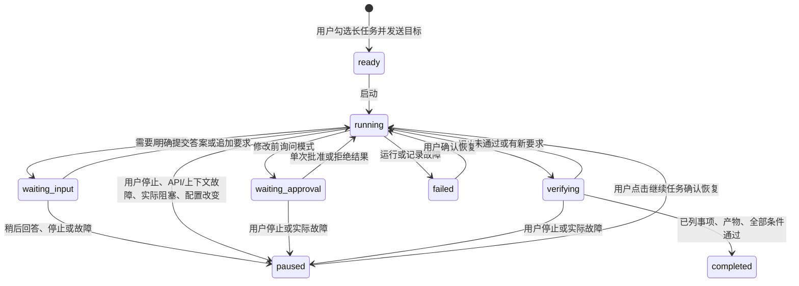

# Agent 长任务循环：源码调研与实现

日期：2026-10-04。本设计对应当前实现，历史计划不替代本文及源码。

## 用户约束与业务目标

主 Agent 自主拆分研究任务，反复调用工具、观察结果、调整计划并验证交付；一轮模型回复结束不代表目标完成。用户勾选长任务后直接发送目标，不填写启动表单或预算；服务正常且任务可推进时持续执行，没有应用设定的累计时长、请求或 token 停止上限。文件操作提供只读、修改前询问、可直接修改三档，不提供完全访问。应用退出后暂停，重开由用户点击确认恢复。子 Agent 继续只读，主 Agent 审查后统一修改。本节按 2026-10-04 用户最新的交互要求更新，替代先前的预算表单方案。

同日界面修订保留右侧 Agent 面板：审批和问询放入对话卡片，先解释目的、对象和影响，再按需查看差异或选择答案。长任务与权限移至输入区。先理解问题、探索资料，任务清单可选且随工作修订；没有预先划分固定阶段或先建计划才能调用文件工具的要求。

用量摘要保留在面板上方、会话选择器下方：显示输入/输出 token、主对话缓存命中率及请求次数，右侧打开用量详情。该布局与输入区的上下文占用、长任务及权限设置分别提供不同信息；没有隐藏缓存统计。

典型链路：读取课题资料 → 多源检索 → 分批读取摘要 → 精排/AI 打分 → 经权限判断入库 → 写研究报告 → 核对原始证据及验收条件。文件整理与只读分析也可独立成任务。

## 实际读取的上游源码

早期循环调研通过 GitHub SSH 获取官方仓库；本次交互调研通过官方 GitHub API 树及固定提交的 raw 源文件读取实现。分析实际循环、目标权限、压缩、文件编辑、审批与问询代码，没有以 README 的功能描述代替源码分析。

- DeepSeek Harness：`deepseek-ai/deepseek-harness`，提交 `5badb15009ae1756c3afe0ae0cef1faafc290ccc`，MIT。
- ZCode：`zai-org/ZCode`，提交 `29628c9acdb81b703bbd4080c207a0e7ce5e276e`，Apache-2.0。
- Codex：`openai/codex`，提交 `afb436df8b70bb5bc57b86d9a3e829968988cd21`；本次读取开源 core/TUI。用户截图用于观察 Codex 桌面交互，未将桌面前端当作已公开或已读源码。

| 问题 | 源码及实际机制 | PaperPilot 的落点 |
| --- | --- | --- |
| 循环如何运行 | [Harness agent.ts](https://github.com/deepseek-ai/deepseek-harness/blob/5badb15009ae1756c3afe0ae0cef1faafc290ccc/packages/core/agent-loop/src/agent.ts#L299) 区分 turn/step，执行工具后继续，异常时补齐工具结果，截断结果不能被后续正常退出覆盖 | `TaskController._loop()` 批次参数先整体验证，再顺序执行与记录；截断整批不执行；结束时补齐未返回的工具调用 |
| 如何持续追求目标 | [Harness goal driver](https://github.com/deepseek-ai/deepseek-harness/blob/5badb15009ae1756c3afe0ae0cef1faafc290ccc/packages/goal/goal-round-driver/src/index.ts) 把自动轮次绑定具体 Agent、goal ID、revision；排队、准入、取消和竞争用户消息分别处理 | 按会话注册单一执行 owner；目标 ID、修订号及运行 ID 分离；补充要求在完整工具批次后进入循环 |
| 如何设定/恢复目标 | [Harness goal authority](https://github.com/deepseek-ai/deepseek-harness/blob/5badb15009ae1756c3afe0ae0cef1faafc290ccc/packages/goal/tool-goal/src/authority.ts) 和 [goal tool](https://github.com/deepseek-ai/deepseek-harness/blob/5badb15009ae1756c3afe0ae0cef1faafc290ccc/packages/goal/tool-goal/src/index.ts#L234) 区分宿主认定的用户输入与自动轮次；目标更改和恢复受权限约束 | 目标及全部验收要求来自用户原消息，权限由面板选择；无预算表单，确认恢复按钮直接续跑；模型没有授予权限、恢复或替换目标的工具 |
| 如何防止目标漂移 | [Harness continuation prompt](https://github.com/deepseek-ai/deepseek-harness/blob/5badb15009ae1756c3afe0ae0cef1faafc290ccc/packages/goal/goal-round-driver/src/prompt.ts) 每轮注入原目标，要求检查实际工作区和持久状态 | 每次主请求末尾重新注入持久目标、条件、补充要求、计划、累计用量及有界证据索引；压缩不改写这些事实 |
| 如何避免只因答复结束而停 | [ZCode continuation loop](https://github.com/zai-org/ZCode/blob/29628c9acdb81b703bbd4080c207a0e7ce5e276e/apps/zcode-cli/packages/core/src/runtime/methods/target-continuation-loop.ts) 在活动目标下继续调度，并给新用户命令让路 | 文本答复之后继续；连续文本或重复操作注入调整提醒，不按固定轮数暂停，实际不能继续时保留未完成状态 |
| 如何判断完成 | [ZCode completion verifier](https://github.com/zai-org/ZCode/blob/29628c9acdb81b703bbd4080c207a0e7ce5e276e/apps/zcode-cli/packages/core/src/runtime/methods/target-completion-verification.ts) 使用独立模型请求和零工具审查 | `finish_task` 先核对计划、证据归属、文件/数据集哈希和实际入库状态，再独立逐条审查全部用户条件 |
| 验收器出错时怎么办 | [ZCode target contracts](https://github.com/zai-org/ZCode/blob/29628c9acdb81b703bbd4080c207a0e7ce5e276e/apps/zcode-cli/packages/contracts/src/tools/target.ts#L289) 此提交对坏 JSON/部分验收链路故障使用 `passed: true` 的 fail-open | PaperPilot 采用失败时不通过：空、截断、坏 JSON、调用工具或缺条件都不能判完成，继续取证；实际 API/上下文故障保留检查点 |
| 上下文如何压缩 | [Harness summarizer](https://github.com/deepseek-ai/deepseek-harness/blob/5badb15009ae1756c3afe0ae0cef1faafc290ccc/packages/compaction/compaction-basic/src/summarizer.ts) 保留原请求前缀并生成结构化检查点；[ZCode compact reminders](https://github.com/zai-org/ZCode/blob/29628c9acdb81b703bbd4080c207a0e7ce5e276e/apps/zcode-cli/packages/core/src/runtime/helpers/compact-post-reminders.ts) 对大文件保留路径与重新读取提示 | 复用既有压缩，在完整工具批次后由宿主标记循环检查点，让一个用户目标的多个执行周期可压缩；目标/计划存元数据；通过 `read_evidence/read_dataset/read_attachment` 有界重读原资料 |
| 如何读写文件 | [Harness edit](https://github.com/deepseek-ai/deepseek-harness/blob/5badb15009ae1756c3afe0ae0cef1faafc290ccc/packages/fs/tool-fs/src/edit.ts) 和 [ZCode edit](https://github.com/zai-org/ZCode/blob/29628c9acdb81b703bbd4080c207a0e7ce5e276e/apps/zcode-cli/packages/core/src/tool/handlers/edit.ts) 要求先读、唯一精确匹配、检查观察版本 | UTF-8 文本按范围读取并记录 SHA256；已有文件须先读；替换片段须唯一；审批与提交前复核文件，原子写入，拒绝旧预览覆盖新内容 |
| 权限放在哪一层 | [ZCode permission service](https://github.com/zai-org/ZCode/blob/29628c9acdb81b703bbd4080c207a0e7ce5e276e/apps/zcode-cli/packages/core/src/permission/service.ts#L392) 区分 Plan/Build/Edit 与高风险模式；[permission recheck](https://github.com/zai-org/ZCode/blob/29628c9acdb81b703bbd4080c207a0e7ce5e276e/apps/zcode-cli/packages/core/src/tool/executor/permission-input-recheck.ts) 复核改动后的输入 | 工具入口判断三档权限；批准仅绑定一个运行、修订和预览；停止、补充要求或版本变化使旧批准失效；不开放全权模式 |
| 如何停止并避免坏工具历史 | [ZCode goal stop](https://github.com/zai-org/ZCode/blob/29628c9acdb81b703bbd4080c207a0e7ce5e276e/apps/zcode-cli/packages/core/src/runtime/methods/goal-state-reminder.ts) 先持久暂停目标，避免在未配对工具之间插入提醒 | 复用取消 token，等网络和子任务退出再释放 owner；验收原始输出单独存盘，完整工具配对后才能追加用户要求或进度消息 |
| 如何避免空转 | [Harness repeat reminder](https://github.com/deepseek-ai/deepseek-harness/blob/5badb15009ae1756c3afe0ae0cef1faafc290ccc/packages/guard/repeat-tool-reminder/src/index.ts) 按完整规范化参数识别重复，默认在 3/5/8 次提醒 | 相同观察在 3/5/8 次及后续间隔提醒调整；纯文本或状态空转也要求实际取证。不因固定次数停止，不伪装成完成；重复签名缓存有界 |

ZCode 该提交中的 `auto` 权限分支仍是预留实现，不把它当作已有智能审批能力。三档权限参考其具体决策层，PaperPilot 没有复制高风险 bypass 模式。实现为适配现有 Python/Flet 架构的原创代码；上游作为设计依据，没有增加其 Node.js 运行依赖。

本次交互设计实际读取的源码及应用方式：

| 交互 | 源码依据 | 项目实现 |
| --- | --- | --- |
| 动态任务清单 | Codex [plan spec](https://github.com/openai/codex/blob/afb436df8b70bb5bc57b86d9a3e829968988cd21/codex-rs/core/src/tools/handlers/plan_spec.rs)、[plan handler](https://github.com/openai/codex/blob/afb436df8b70bb5bc57b86d9a3e829968988cd21/codex-rs/core/src/tools/handlers/plan.rs) 将清单更新作为独立工具与事件；ZCode [todo renderer](https://github.com/zai-org/ZCode/blob/29628c9acdb81b703bbd4080c207a0e7ce5e276e/packages/ui/src/ToolCallBlocks/renderers/todo.tsx) 紧凑显示当前事项与可展开清单 | 清单可选；已知事项随发现更新，保留依赖约束与真实证据，支持取消过时事项；取消不改变用户条件 |
| 真实用户问询 | Codex [request handler](https://github.com/openai/codex/blob/afb436df8b70bb5bc57b86d9a3e829968988cd21/codex-rs/core/src/tools/handlers/request_user_input.rs)、[schema](https://github.com/openai/codex/blob/afb436df8b70bb5bc57b86d9a3e829968988cd21/codex-rs/core/src/tools/handlers/request_user_input_spec.rs) 区分可用模式、真实答复与已验证回答；[TUI state](https://github.com/openai/codex/blob/afb436df8b70bb5bc57b86d9a3e829968988cd21/codex-rs/tui/src/bottom_pane/request_user_input/mod.rs)、[render](https://github.com/openai/codex/blob/afb436df8b70bb5bc57b86d9a3e829968988cd21/codex-rs/tui/src/bottom_pane/request_user_input/render.rs) 分离问题、选项、备注及提交 | 原生工具提出具体问题，宿主校验请求身份；可选项或自由输入，等待明确提交，不自动回答。PaperPilot 用于长任务，不复制 Codex 的模式开关限制 |
| 审批说明与内容 | Codex [approval overlay](https://github.com/openai/codex/blob/afb436df8b70bb5bc57b86d9a3e829968988cd21/codex-rs/tui/src/bottom_pane/approval_overlay.rs)、[apply patch header](https://github.com/openai/codex/blob/afb436df8b70bb5bc57b86d9a3e829968988cd21/codex-rs/tui/src/bottom_pane/apply_patch_header.rs) 将理由、实际文件路径与决定分开；ZCode [PermissionDialog](https://github.com/zai-org/ZCode/blob/29628c9acdb81b703bbd4080c207a0e7ce5e276e/packages/ui/src/PermissionDialog.tsx) 过滤内部通用理由并优先展示面向用户的说明 | 对话卡片显示模型给出的具体目的、文件/文献范围及行数，修改内容按需展开；保留冻结预览、单次批准、版本复核；不提供批准整会话或扩大访问的选项 |
| 展示问题与回答 | ZCode [ask-question renderer](https://github.com/zai-org/ZCode/blob/29628c9acdb81b703bbd4080c207a0e7ce5e276e/packages/ui/src/ToolCallBlocks/renderers/ask-question.tsx) 分开问题正文、回答与执行状态 | 问题和明确回答持久保存；卡片状态与自然语言回复分离，不向用户倾倒协议 JSON 或证据 UUID |

没有运行上游应用或新增 Rust/Node 依赖；借鉴其交互及权限分层，继续使用现有 Flet 设计令牌、三档权限和会话契约。

## 运行状态与权限契约

`AgentRun` 是资源与取消生命周期；长任务完成以 `agent_task.status` 为准。循环状态被设置为完成前必须通过验收。异常保存失败不能落入原有的默认“运行 completed”；暂停记录由控制器统一生成，真实故障不被写成用户停止。

| 模式 | 工作区文件 | 课题文献库 | 内部记录与公共检索 |
| --- | --- | --- | --- |
| `read_only` | 可读，不能改 | 可读，不能入库 | 正常保存会话、证据、缓存并调用检索/模型 |
| `ask_edit` | 每次具体修改预览后询问 | 每次待入库论文清单询问 | 正常运行 |
| `direct_edit` | 在同一工作区边界内直接修改 | 在当前课题内直接入库 | 正常运行 |

所有模式均不提供任意终端、删除、工作区外升级、软/硬链接或 Windows junction、密钥文件、数据库和会话私有存储的修改。文件上限 1 MiB；读取最多 300 行/20,000 字符，列举/搜索最多 200 条并标注截断。PDF、Office 和图片通过原有不可变附件链路提供，不能把摘录等同于全文。

界面自动使用课题目录的 `agent_workspace/`，不存在时创建；已有任务恢复保持原工作区，包括先前显式选择的目录。权限在输入区下拉框选择，只作用于长任务 Agent 的工具，不是整个应用的全局只读开关。子 Agent 永远没有主 Agent 的文件和文献库修改工具。成功操作记录实际审批事实与具体理由，供验收核对；旧文件证据被拒绝时提示有效的当前版本记录，不放宽文件哈希要求。

## 长任务记忆、用量和恢复

- `conversation.py` 的元数据保存 `agent_task`，含目标、条件、版本、计划、证据索引、权限、累计用量与待核对操作。目标不依赖压缩摘要。沿用 metadata 事件信封，对证据追加和映射更新写增量日志，在创建与终止边界保存完整状态；旧聊天事件保持可读取。
- `sessions/{chat}/tasks/{task_id}/` 保存不可变数据集、完整工具观察、原始模型响应和验收输出。模型仅取有界投影，不能读写这些内部文件。数据集哈希须匹配，上限 64 MiB；输入超过限制则报错，不静默删减科研记录。
- 单个用户目标可能产生很多工具周期。完整配对后宿主写入 `loop_checkpoint` 元数据作为安全压缩边界，默认保留最近周期；不伪造用户消息、不在待返回工具之间截断。摘要仍有损，原目标、计划和原始历史分别保留。
- 面向用户的进度来自模型的自然语言正文；单纯保存状态的检查点属于隐藏内部消息。显示层只修复明确的正文转义换行，并以可读来源替代内部记录 ID；代码、路径、文件字节和原始消息保持原样，不做全局转义解码。
- 问询不是修改授权。答案先落盘，完整工具配对后追加真实用户输入并提升目标修订，独立验收同时读取原条件与真实答案；等待期间不再发模型请求。拒答/稍后回答暂停并保存问题，重开确认恢复重新发起请求，旧入口不可复用；没有默认选项自动提交或计时自动回答。
- 用户已经提交答案但当前批次尚未完成时异常退出，确认恢复会将已落盘的真实答案补入历史，不重新询问；请求标识用于避免历史已写而状态未写造成重复。单题超长答复提示精简，保留草稿和待答入口。
- 每轮提醒保留原始附件索引。`read_attachment` 每次最多重读 8,000 字符的既有摘录并核对资产；图片在完整工具结果之后以原生协议送入下次请求，选入验收证据的图片也提供给零工具验收。源文件删除不影响已保存快照；资产损坏或缺失则拒绝读取。它不扩大原解析范围，也不能修改原附件，日志不存图片 base64。
- Windows 文件系统调用使用 `file_paths.py` 的扩展长度路径，逻辑归属检查仍用普通绝对路径。原子写的临时文件、任务证据和工作区读写都支持超过 260 字符的路径，不用缩短课题名规避保存失败。损坏检查点保留原件并显示错误，不能自动启动。
- 主 Agent 工具批次顺序执行，避免以并行写操作破坏依赖；不同数据源复用现有并行检索。中文术语复用现有翻译器。排序、打分和入库复用公开入口与现行算法。
- 团队成员仍并行只读分析。每个团队的资料编号固定；用完既有批次预算后可建立新团队并给出新快照，旧标识不能跨团队追问，记录不会被新团队覆盖。
- `TaskBudget` 保留共享用量计数：主模型、子模型、翻译、打分、压缩及验收均计入。请求前估算输入、工具定义和输出，返回真实计数后结算；缺失/中断或重启未结算请求按预留估算。生产界面 `limits` 三项为 `None`，没有停止上限或计时终止器；旧额度配置忽略，旧检查点确认恢复后解除限制且保留计数。有限参数只供显式有界的内部验证探针使用。
- 时长包含本次活跃运行、工具与等待审批，暂停/关闭期间不计入。重启前已保存的秒数可恢复；突发退出到最近检查点之间的小段时间无法精确追回。累计用量只作记录，实际余额及账单以服务商为准，不臆造跨服务商余额查询 API。
- 客户端保留网络/5xx 的既有有限重试。非流式结果新增可选 `error_type`，只保存异常类型；请求真实失败时暂停并提示检查连接或额度，避免把认证/额度错误当作空回复无限循环。请求正常但模型仅回复文本或工具参数有误时提醒调整并继续。
- 模型服务商、端点或主模型在运行期间切换时暂停，确认恢复后采用新配置。配置不能让一轮内的已批准操作变成另一个目标或另一份内容。
- 写入前记录 intent；恢复时比较实际文件与修改前/后哈希，确认已落盘的结果并补证，不自动重放旧批准。入库结果不确定时要求重新读当前文献库核对。重开仅恢复显示状态，不启动线程或模型请求。
- 会话 UUID 固定主/子运行归属，课题改名移动目录不会产生第二个 owner。项目内工作区保存相对定位并随目录迁移，显式选择的项目外工作区保持原位置；运行中移动会暂停、取消团队并要求确认恢复，已完成任务的验收记录继续保留。启动后尚未进入循环的检查点，重开同样需确认。
- 补充要求在输入框输入并按 Enter，排队并在完整工具批次边界注入；单个待答问题优先接收该文字作为明确回复。等待审批时新要求会使旧预览失效。替换原目标/验收条件应新建任务，旧记录保留。

这是工具层的边界与冲突检测，不是对恶意本地进程的操作系统级隔离。独立验收由当前配置的同一模型另发零工具请求完成，不等同于人工科研质量审查。

## 验证入口与证据范围

见 `TESTING.md`。新场景分别覆盖业务、实际 SDK 对本地 HTTP 的协议链路、原生 Flet 控件与渲染；真实外部数据源、付费模型的长时稳定性与科研质量必须单列。不能用测试数量或旧报告替代这些边界。
